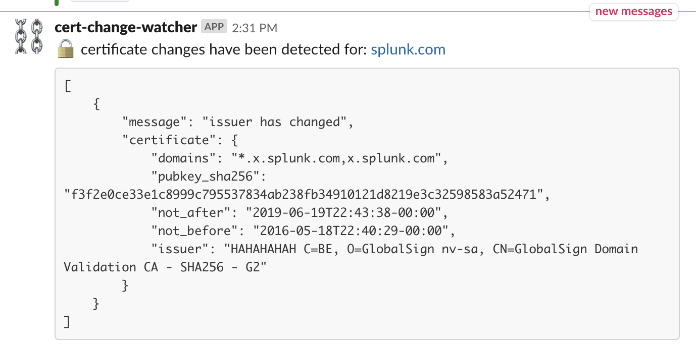

# cert-change-watcher
Alerts when a issuer or domain changes in your certificates

# Installation
1. Get a API key from: https://sslmate.com/certspotter/
2. `git clone https://github.com/d1vious/cert-change-watcher.git`
3. `cd cert-change-watcher && virtualenv venv && source venv/bin/activate && pip install -r requirements.txt`

## Usage

```
cert-change-monitor.py [-h] -k APITOKEN [-s SLACKHOOK] -d DOMAINS

monitors certificate changes using cert spotter api and alerts to slack

optional arguments:
  -h, --help            show this help message and exit
  -k APITOKEN, --apitoken APITOKEN
                        api token for cert spotter, example 1234_adfdafasfdas
  -s SLACKHOOK, --slackhook SLACKHOOK
                        slack web hook to notify of changes
  -d DOMAINS, --domains DOMAINS
                        command delimited list of domains to monitor changes
                        for, example "splunk.com,elastic.com"

In order to use this tool you will need an API key from certspotter, and also
provide the slack API web hook.
```

## Examples

#### First run
```
── # python cert-change-watcher.py -k $CERTSPOTTER_TOKEN -d splunk.com
## seems this is our first run .. certspotter state file not present ##
## creating one at .certspotter.json ##
── # python cert-change-watcher.py -k $CERTSPOTTER_TOKEN -d splunk.com
## no changes ##
```

#### When a domain changes
```
── # python cert-change-watcher.py -k $CERTSPOTTER_TOKEN -d splunk.com
## domain splunk.com has changes: ##
{
    "message": "issuer has changed",
    "certificate": {
        "domains": "*.x.splunk.com,x.splunk.com",
        "pubkey_sha256": "f3f2e0ce33e1c8999c795537834ab238fb34910121d8219e3c32598583a52471",
        "not_after": "2019-06-19T22:43:38-00:00",
        "not_before": "2016-05-18T22:40:29-00:00",
        "issuer": "HAHAHAHAH C=BE, O=GlobalSign nv-sa, CN=GlobalSign Domain Validation CA - SHA256 - G2"
    }
}
## updating state .certspotter.json ##
```

#### When multiple domains change

```
── # python cert-change-watcher.py -k $CERTSPOTTER_TOKEN -d "splunk.com,elastic.com"
## domain splunk.com has changes: ##
{
    "message": "issuer has changed",
    "certificate": {
        "domains": "*.x.splunk.com,x.splunk.com",
        "pubkey_sha256": "f3f2e0ce33e1c8999c795537834ab238fb34910121d8219e3c32598583a52471",
        "not_after": "2019-06-19T22:43:38-00:00",
        "not_before": "2016-05-18T22:40:29-00:00",
        "issuer": "HAHAHAHAH C=BE, O=GlobalSign nv-sa, CN=GlobalSign Domain Validation CA - SHA256 - G2"
    }
}
## domain elastic.com has changes: ##
{
    "message": "domains have changed",
    "certificate": {
        "domains": "shoes.com,elastic.com,www.elastic.com",
        "pubkey_sha256": "6a9f8e6f1c872dfe52a6789b1f86c397842673034b0a30fa20e170596cab57a5",
        "not_after": "2019-11-20T15:52:09-00:00",
        "not_before": "2016-11-01T13:44:39-00:00",
        "issuer": "C=US, ST=Arizona, L=Scottsdale, O=\"GoDaddy.com, Inc.\", OU=http://certs.godaddy.com/repository/, CN=Go Daddy Secure Certificate Authority - G2"
    }
}
## updating state .certspotter.json ##
```

#### Send a slack alert with a change
```
python cert-change-watcher.py -k $CERTSPOTTER_TOKEN -d "splunk.com,elastic.com" -s https://hooks.slack.com/services/xxx/xxxx
```
and here is an example of what it looks like:

